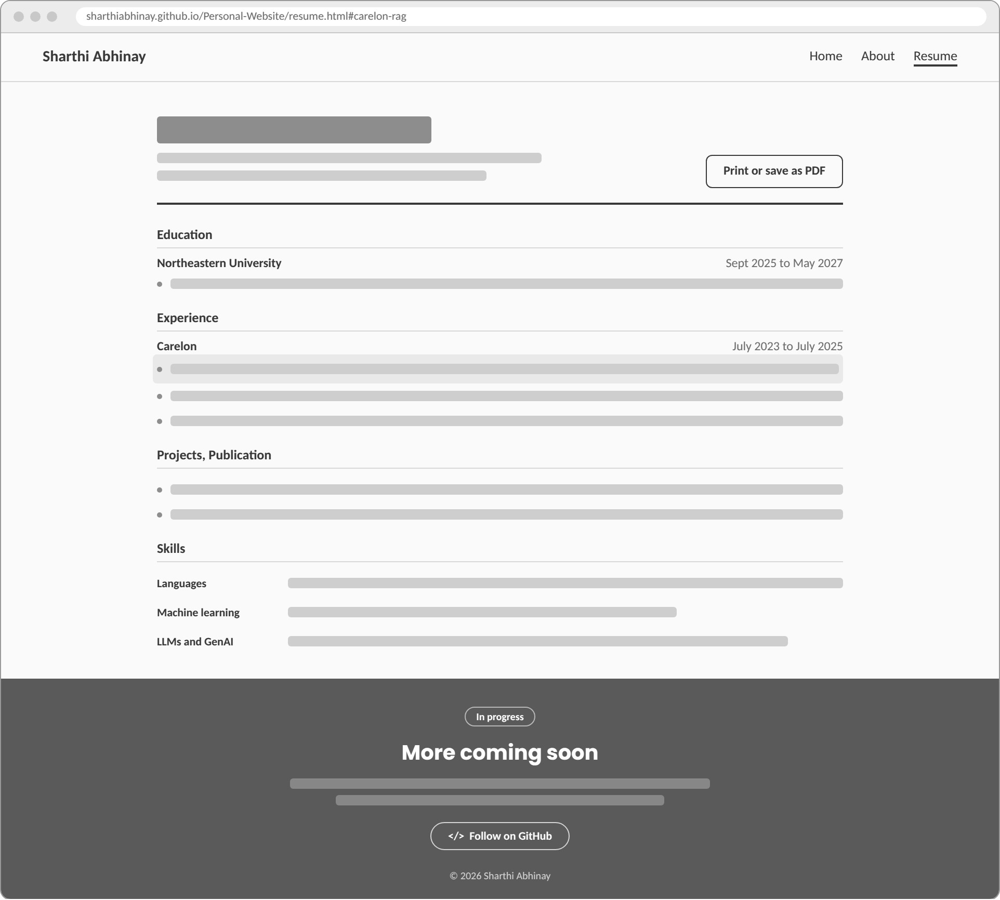

# Design Document: Sharthi Abhinay Personal Homepage

## Project Description

This is my personal homepage for CS 5610 Web Development at Northeastern University. It serves two purposes: it meets the requirements of Project 1, a multi-page static front-end site, and it works as a real portfolio for the data science and AI roles I'm applying to as I finish my MS in Computer Science in May 2027.

The site has three pages:

- **Home** opens with "Hello, I'm Sharthi," my photo, a Search my resume tool, and three pieces of selected work.
- **About** tells how I moved from chemical engineering at IIT Patna into AI, what I care about, and a timeline of my path.
- **Resume** (AI-generated) lists my education, experience, projects, publication, skills, and accomplishments, and prints as a clean PDF.

Each page ends with its own footer: a simple bar on Home, a "Let's work together" band on About with my email, LinkedIn, GitHub, and a button that copies my email address, and a "More coming soon" band on Resume that links to my GitHub.

As the assignment requires, one page is AI-generated: the Resume page (`resume.html`) was generated with Claude (Anthropic, Claude Opus 5.5) from my resume notes. The prompt is listed in the GenAI Usage section of the README.

It's built with vanilla HTML5, CSS3, and JavaScript ES6 modules, with Bootstrap 5 for the grid and navigation. There is no backend, no framework, and no jQuery.

The creative feature is the resume search. Most portfolios list skills and ask visitors to trust them. Mine lets visitors check for themselves: they type a skill such as "RAG" or "PyTorch," and the page ranks every line of my resume using TF-IDF and cosine similarity, highlights the matching words, and links to the exact line on the resume page. It's a small version of the retrieval step in the RAG systems I built as an Associate Software Engineer at Carelon.

---

## User Personas

### Persona 1: Maya Thompson, the technical recruiter

**Age:** 31
**Role:** Technical recruiter at a health-tech AI company
**Device:** Laptop, and her phone between calls or at career fairs
**Tech literacy:** Moderate. She knows the vocabulary but isn't an engineer.

**Goals:**

- Confirm quickly that a candidate matches a role, for example RAG and LLM experience
- Get a clean resume to forward to the hiring manager
- Contact the candidate in one step

**Frustrations:**

- Portfolios with animation but little substance
- Skills buried deep in long pages
- Resumes that don't open well on a phone

**How she uses the site:**
Maya screens more than 60 candidates a week and has about a minute for each. She needs to know three things fast: what does this person do, can they do what my role needs, and how do I reach them.

---

### Persona 2: David Park, the engineering manager

**Age:** 39
**Role:** Engineering manager on an applied machine learning team
**Device:** Laptop, mostly with the keyboard because of a wrist injury
**Tech literacy:** High. He ships LLM features in production.

**Goals:**

- Judge technical depth: evaluation, latency, and production concerns
- See how the candidate thinks, not just which tools they've touched
- Read real code on GitHub

**Frustrations:**

- Buzzword lists with no evidence
- Inflated or unmeasured claims
- Sites that can't be used without a mouse

**How he uses the site:**
David reads candidate sites carefully in the evening. He looks for numbers first, then opens the repository to see whether the code matches the claims.

---

### Persona 3: Dr. Elena Ruiz, the professor

**Age:** 52
**Role:** Associate professor in public health informatics
**Device:** Laptop, with browser zoom at 150% because of low vision
**Tech literacy:** High in her field, and she reads research closely

**Goals:**

- Understand a student's motivation and research background
- Find and read their published work
- Judge whether their interests fit her lab

**Frustrations:**

- Small, low-contrast text
- Layouts that break when zoomed
- No evidence of research experience

**How she uses the site:**
Elena runs a lab applying machine learning to disease surveillance and is looking for a graduate research assistant. She reads the About page first and follows links to papers.

---

## User Stories

### Story 1: Maya checks for a skill

Maya has an open role for an engineer with retrieval-augmented generation experience. She opens Sharthi's site from his LinkedIn profile and types "RAG" into the search box. Five lines of his resume appear, ranked, with "RAG" and "retrieval" highlighted. The top result mentions an accuracy gain from 66% to 78% for more than 200 users. She clicks "See this line on my resume," and the resume opens with that exact line highlighted. She's convinced in under a minute.

_As a recruiter, I want to search a candidate's resume for a skill so that I can confirm their experience without reading every page._

- 1.1 Typing a query and pressing Enter, or clicking a suggestion chip, shows up to five ranked results.
- 1.2 Matching words are highlighted, and abbreviations like RAG also match "retrieval."
- 1.3 Each result links to its exact line on the resume, which is highlighted on arrival.
- 1.4 An empty or unmatched query shows a helpful message instead of a blank area.

### Story 2: Maya follows up after a career fair

After a career fair, Maya has twenty links and twenty half-remembered conversations. On the train home she opens Sharthi's site on her phone. His photo appears first, above "Hello, I'm Sharthi," and she recognizes him. She opens the About page, scrolls to the "Let's work together" footer, taps Copy next to his email, and pastes the address into her notes to follow up tomorrow.

_As a recruiter on my phone, I want to recognize the candidate and save their contact details quickly so that I can follow up while the conversation is fresh._

- 2.1 At phone widths, the photo appears above the headline and the layout stacks into one column.
- 2.2 The navigation collapses into a menu button that works by touch and keyboard.
- 2.3 The Copy button copies the email address and confirms with "Copied."

### Story 3: Maya forwards the resume

The hiring manager asks Maya for a PDF. She opens the Resume page and clicks "Print or save as PDF." The printout drops the navigation, footer, and colors, leaving a clean black-and-white document with proper margins. She saves it and attaches it to her email.

_As a recruiter, I want a clean PDF of the resume so that I can share it inside my company's hiring system._

- 3.1 The button opens the browser's print dialog.
- 3.2 The print view hides the navigation, the footer, and the button itself, and uses black text with page margins.
---

## Design Mockups

### Home and About pages

My hand-drawn sketches of the Home and About pages are in [Design of home and about.pdf](res/mockups/Design%20of%20home%20and%20about.pdf).

- **Home:** my name and the navigation at the top, a brief introduction beside my photo with resume and email buttons, a Search my resume panel with a custom search box and predefined suggestions, and my main projects.
- **About:** my name and the navigation at the top, the story of my journey on the left, and a timeline on the right.

### Resume page (AI-generated)

The header holds my name, contact details, and a Print or save as PDF button, followed by education, experience, projects, publication, and skills.

_Note: The page footers were designed and changed during building._

