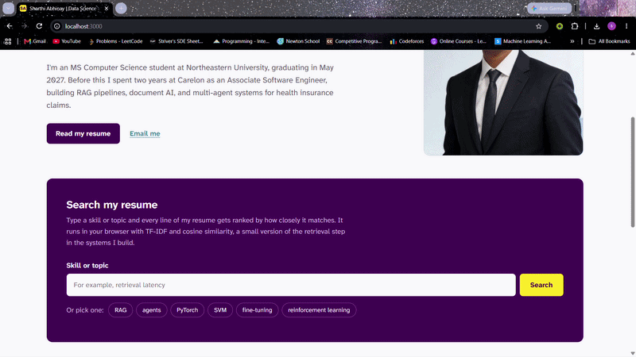

# Sharthi Abhinay, Personal Homepage

A personal and professional homepage that traces my path from chemical engineering to AI, and lets visitors search my resume the way a retrieval system searches documents.

**Live site:** https://sharthiabhinay.github.io/Personal-Website/

## Author

**Sharthi Abhinay**\
[sharthiabhinay@gmail.com](mailto:sharthiabhinay@gmail.com) | [LinkedIn](https://www.linkedin.com/in/sharthi-abhinay)

## Class

CS 5610 Web Development, Northeastern University.\
Instructor: John Alexis Guerra Gomez.\
Course page: https://johnguerra.co/classes/webDevelopment_online_fall_2026/

## Project Objective

Build a responsive, multi-page personal homepage that shows who I am and what I have built in data science and AI, and that behaves a little like the systems I work on.

- **Home** introduces me and includes a "Search my resume" tool. A visitor types a skill or topic, and the page ranks every line of my resume by TF-IDF and cosine similarity, highlights the matching words, and links to the exact line on the resume page.
- **About** tells how I moved from chemical engineering to AI, what I care about (AI for public health, grounded and measurable systems), and a timeline of my path.
- **Resume** lists my education, experience, projects, publication, skills, and accomplishments, with a button that prints the page as a clean PDF.

Each page has its own footer: a simple bar on Home, a "Let's work together" band on About with my email, LinkedIn, GitHub, and a button that copies my email address, and a "More coming soon" band on Resume that links to my GitHub.

## Screenshot

[](https://sharthiabhinay.github.io/Personal-Website/)

## Video Demo

A short narrated walkthrough of the site and the resume search: [watch on YouTube](https://youtu.be/REPLACE-WITH-YOUR-VIDEO-ID)

## Design Document

[DESIGN.md](DESIGN.md) covers the project description, user personas, user stories, and design mockups.

## Design

- **Color:** stops from the viridis colormap (matplotlib's default). Deep purple `#440154` for headings, the search panel, and the footers, blue-teal `#2A788E` for links, yellow `#FDE725` for search highlights. The same ramp colors the relevance bars on the home page and the dots on the About timeline.
- **Type:** one family, Atkinson Hyperlegible Next, designed by the Braille Institute for readability.
- **Accessibility:** skip link, visible keyboard focus, labeled search input, `aria-live` announcements for search results and the Copy email confirmation, color contrast checked against WCAG AA, and reduced motion respected.

## Tech Stack

| Layer      | Technologies                         |
| ---------- | ------------------------------------ |
| Markup     | HTML5                                |
| Styling    | CSS3, Bootstrap 5.3.8, Google Fonts  |
| Scripting  | Vanilla JavaScript (ES6 modules)     |
| Tooling    | ESLint, Prettier, Node.js (dev only) |
| Deployment | GitHub Pages (static hosting)        |

## Project Structure

```text
.
├── index.html          # Home: intro, resume search, selected work
├── about.html          # About: story, interests, timeline
├── resume.html         # Resume: full data science and AI resume
├── css/
│   └── style.css       # All custom styles, including print styles
├── js/
│   ├── corpus.js       # Resume lines used by the search
│   ├── search.js       # TF-IDF index, ranking, and results rendering
│   ├── resume.js       # Print or save as PDF button
│   └── contact.js      # Copy email button in the About footer
├── res/
│   ├── demo.gif        # Scrolling demo shown in this README
│   ├── favicon.svg     # SA monogram shown in the browser tab
│   ├── mockups/        # Mockups used in DESIGN.md
│   └── sharthi-abhinay.jpg  # Profile photo on the home page
├── DESIGN.md           # Project description, personas, user stories, mockups
├── eslint.config.js    # Class ESLint config
├── package.json        # Dependencies and npm scripts
├── package-lock.json   # Exact installed versions
├── LICENSE
└── README.md
```

## How the search works

1. `corpus.js` holds every resume line with an id that matches an element on `resume.html`.
2. `search.js` tokenizes each line, applies a light stemmer, and builds a TF-IDF vector per line.
3. A query is expanded with a few common abbreviations (for example, RAG, LLM, RL), turned into a vector, and compared to every line with cosine similarity.
4. The top five matches are shown with their score, the matching words highlighted, and a link that jumps to that line on the resume, where it is highlighted.

Everything runs in the browser. There is no server and no API call.

## Instructions to Build

This is a static site with no build step.

### 1. Clone the repository

```bash
git clone https://github.com/SharthiAbhinay/Personal-Website.git
cd Personal-Website
```

### 2. Open it

The JavaScript uses ES6 modules, which browsers block when a page is opened straight from the file system. Run a local server instead:

```bash
npx serve .
```

Then open the address it prints, usually http://localhost:3000. In VS Code, the Live Server extension works too.

### 3. Lint (optional)

Requires Node.js. Install the dev tools, then check the JavaScript with the class ESLint config:

```bash
npm install
npm run lint
```

## GenAI Usage

**Tool:** Claude by Anthropic (claude.ai), model Claude Opus 5.5

**Prompts used:**

1. "create a clear and descriptive README including: Author, Class Link, Project Objective, Screenshot, Instructions to build"
2. "Given the rubiric please check the code for any ommisions or any missing parts"
3. "Create a resume.html page for my personal website from my resume below, with all sections described in resume, and add a Resume tab to the navigation bar on every page. Include a "Print or save as PDF" button, plus print CSS that hides the navigation and footer. Match the fonts, colors, and Bootstrap 5 layout already in css/style.css."

## Sources and References

- Bootstrap 5 documentation: https://getbootstrap.com/docs/5.3/
- MDN Web Docs: https://developer.mozilla.org
- Viridis colormap: https://bids.github.io/colormap/
- Atkinson Hyperlegible Next on Google Fonts: https://fonts.google.com/specimen/Atkinson+Hyperlegible+Next
- TF-IDF overview: https://en.wikipedia.org/wiki/Tf%E2%80%93idf
- Poppins (SIL Open Font License), used for the favicon letters: https://fonts.google.com/specimen/Poppins

## License

MIT License. See the [LICENSE](LICENSE) file for details.
