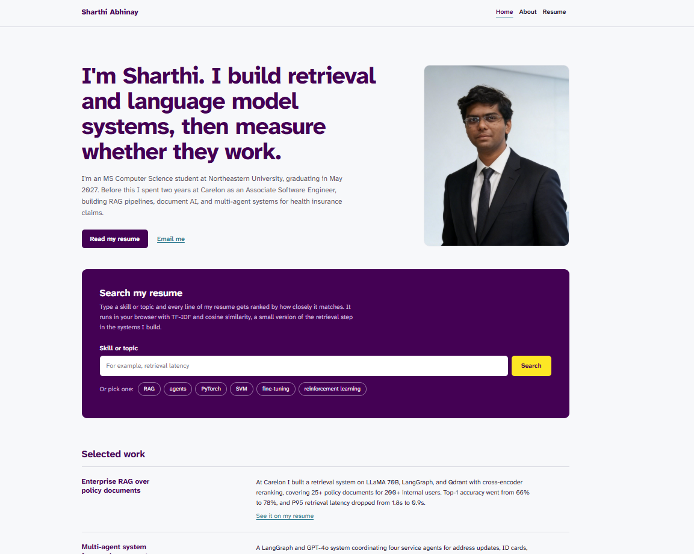

# Sharthi Abhinay, Personal Homepage

A personal homepage focused on data science and AI, built with HTML5, CSS3, vanilla JavaScript, and Bootstrap 5. It is written for recruiters, professors, and classmates who want to see my experience with retrieval systems, language models, and machine learning research.

**Live site:** https://sharthiabhinay.github.io/Personal-Website/

## Author

**Sharthi Abhinay**
[sharthiabhinay@gmail.com](mailto:sharthiabhinay@gmail.com) | [LinkedIn](https://www.linkedin.com/in/sharthi-abhinay)

## Class

CS 5610 Web Development, Northeastern University.\
Instructor: John Alexis Guerra Gomez.\
Course page: https://johnguerra.co/classes/webDevelopment_online_fall_2026/

## Project Objective

Build a responsive, multi-page personal homepage that shows who I am and what I have built in data science and AI, and that behaves a little like the systems I work on.

- **Home** introduces me and includes a "Search my resume" tool. A visitor types a skill or topic, and the page ranks every line of my resume by TF-IDF and cosine similarity, highlights the matching words, and links to the exact line on the resume page.
- **About** tells how I moved from chemical engineering to AI, what I care about (AI for public health, grounded and measurable systems), and a timeline of my path.
- **Resume** lists my education, experience, projects, publication, skills, and accomplishments, with a button that prints the page as a clean PDF.

## Screenshot

[](https://sharthiabhinay.github.io/Personal-Website/)

## Design

- **Color:** stops from the viridis colormap (matplotlib's default). Deep purple `#440154` for headings and the search panel, blue-teal `#2A788E` for links, yellow `#FDE725` for search highlights. The same ramp colors the relevance bars on the home page and the dots on the About timeline.
- **Type:** one family, Atkinson Hyperlegible Next, designed by the Braille Institute for readability.
- **Accessibility:** skip link, visible keyboard focus, labeled search input, an `aria-live` status for search results, color contrast checked against WCAG AA, and reduced motion respected.

## Tech Stack

| Layer | Technologies |
| --- | --- |
| Markup | HTML5 |
| Styling | CSS3, Bootstrap 5.3.8, Google Fonts |
| Scripting | Vanilla JavaScript (ES6+) |
| Tooling | ESLint, Prettier, Node.js (dev only) |
| Deployment | GitHub Pages (static hosting) |

## Project Structure

```text
.
├── index.html          # Home: intro, resume search, selected work
├── about.html          # About: story, interests, timeline
├── resume.html         # Resume: full data science and AI resume
├── css/
│   └── style.css       # All custom styles, including print styles
├── js/
│   ├── corpus.js       # Resume lines used by the search
│   ├── search.js       # TF-IDF index, ranking, and results rendering
│   └── resume.js       # Print or save as PDF button
├── res/
│   ├── favicon.svg     # SA monogram shown in the browser tab
│   ├── sharthi-abhinay.jpg  # Profile photo on the home page
│   └── screenshot.png  # Screenshot used in this README
├── eslint.config.js
├── package.json
├── LICENSE
└── README.md
```

## How the search works

1. `corpus.js` holds every resume line with an id that matches an element on `resume.html`.
2. `search.js` tokenizes each line, applies a light stemmer, and builds a TF-IDF vector per line.
3. A query is expanded with a few common abbreviations (for example, RAG, LLM, RL), turned into a vector, and compared to every line with cosine similarity.
4. The top five matches are shown with their score, the matching words highlighted, and a link that jumps to that line on the resume, where it is highlighted.

Everything runs in the browser. There is no server and no API call.

## Instructions to Build

This is a static site with no build step.

### 1. Clone the repository

```bash
git clone https://github.com/SharthiAbhinay/Personal-Website.git
cd Personal-Website
```

### 2. Open it

The scripts load as classic deferred scripts, so you can open `index.html` directly in a browser. To run it on a local server instead:

```bash
npx serve .
```

### 3. Lint and format (optional)

```bash
npm install
npm run lint
npm run format
```

## GenAI Usage

**Tool:** Claude by Anthropic (claude.ai), model Claude Opus 5.5

**Prompts used:**

1. "Write vanilla JavaScript functions,that rank the lines of a global CORPUS resume array against a search query using stemming, abbreviation expansion, TF-IDF weighting, and cosine similarity, and return the top 5 as { doc, score }."
2. "Add my picture to the right of the headline and suggest ways to adjust its background or size."
3. "Suggest some ideas for a favicon for the browser tab."
4. "Show res/screenshot.png as a picture in the README and put the Class lines on separate lines."
5. "Check the README for anything missing, unclear, or incorrectly represented."

## Sources and References

- Bootstrap 5 documentation: https://getbootstrap.com/docs/5.3/
- MDN Web Docs: https://developer.mozilla.org
- Viridis colormap: https://bids.github.io/colormap/
- Atkinson Hyperlegible Next on Google Fonts: https://fonts.google.com/specimen/Atkinson+Hyperlegible+Next
- TF-IDF overview: https://en.wikipedia.org/wiki/Tf%E2%80%93idf
- Poppins (SIL Open Font License), used for the favicon letters: https://fonts.google.com/specimen/Poppins

## License

MIT License. See the [LICENSE](LICENSE) file for details.
